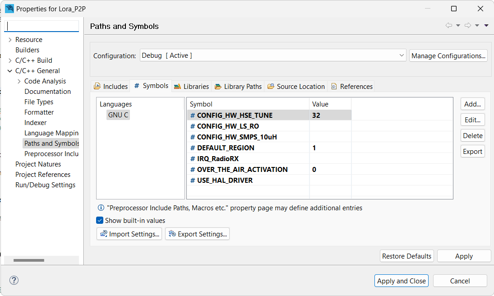
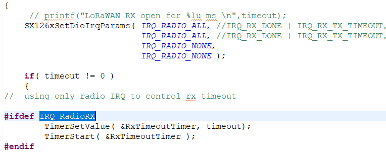

## [Unreleased]

- IRQ_RadioRX renamed to LoRa
- LoRa flag disable some print commands on the SDK. 

## [1.1.0] - 2023-10-05

- ADVSPT-27
    - A symbol can be added to the project properties to enable LoRa radio control using the available interrup (IRQ).
    - Symbol: IRQ_RadioRX
    - The symbol does not require a value to be set, the symbol presence is enough to enable the interrupt.
    - The default SX1262 default regulator mode was changed to LDO.

## [1.0.0] - 2023-10-05

- The original HT Micron HTLRBL32L SDK was forked.