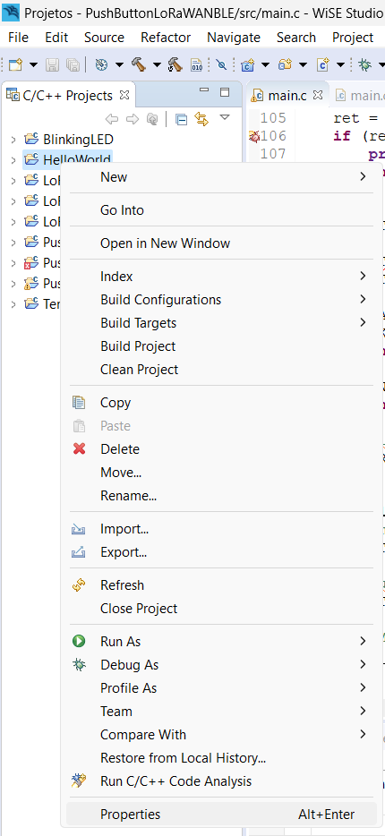
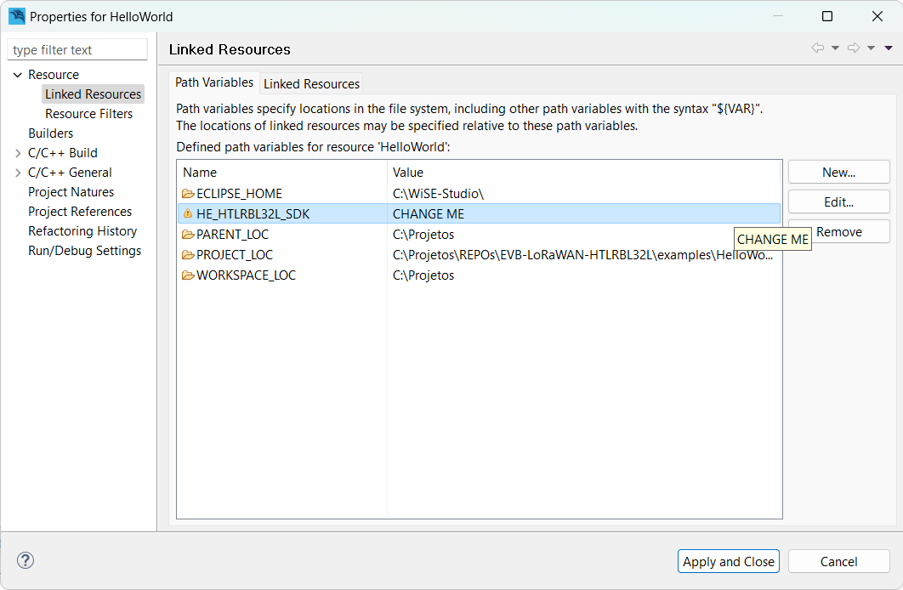
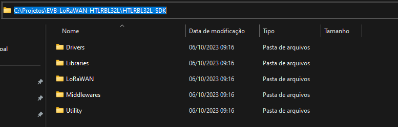
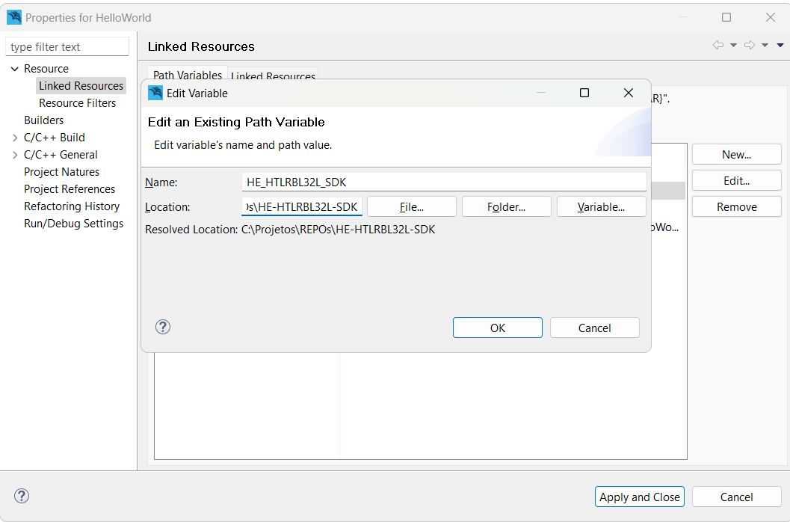

# HTLRBL32L-SDK
This GitHub repository hosts an SDK for the Hana Electronics [Evaluation Board](https://github.com/Hana-Electronics/EVB-LoRaWAN-HTLRBL32L) (HTLRBL32L based), providing developers with essential tools and resources for firmware development.

## Setting up the SDK 
In WiSE Studio, right-click on the project, go to 'Properties'

  

 
Click on Linked Resources, then select the 'HE-HTLRBL32L-SDK' variable and click on 'Edit'. 

  

 
Where it says 'CHANGE ME' paste the directory path of the SDK files.

  

  
Apply the changes and close the window.

  

 
Have fun with your project :)

## Release Notes

To check the release notes, please read the [README](https://github.com/Hana-Electronics/HE-HTLRBL32L-SDK/blob/v1.1.0/Docs/release-notes.md)
